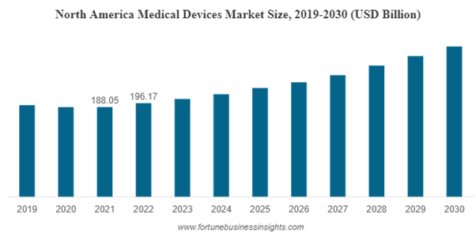
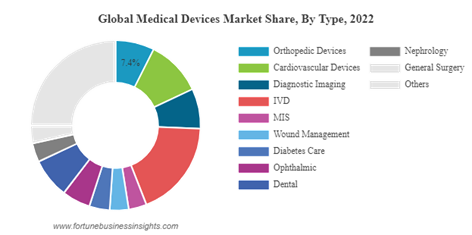

## The Problems in Modern Healthcare

### Manual Operation & Human Error

Many medical devices still require manual setup and operation, which
introduces the potential for human error. Misconfigurations, missed
steps, or incorrect settings can have severe consequences, from
diagnostic inaccuracies to patient harm.

The challenges and inefficiencies in healthcare systems stem
significantly from manual device operations and the inevitable human
errors that come with them. In a vivid illustration, consider a city
hospital where a nurse, already juggling multiple tasks, accidentally
set an IV pump\'s infusion rate too high. The result being that a
patient, requiring a steady dosage, experienced an overdose, emphasizing
the harsh realities and repercussions of manual operations.

### Integration Issues

Healthcare facilities often utilize medical devices from various
manufacturers. These devices may not always seamlessly integrate with
each other or with centralized healthcare IT systems. Without a unified
system, real-time data sharing and monitoring can be problematic,
limiting the potential for holistic patient care.

With the rise of advanced technology, hospitals are equipped with
state-of-the-art devices. Yet, the lack of integration can pose severe
challenges. For example, In a major city hospital, the inability of
these high-end devices from different manufacturers to communicate
during a critical emergency will result in delayed and complicated
decision-making processes.

### Operational Inefficiencies

Manually operated devices might be time-consuming and could divert
clinicians\' attention from direct patient care. Regular maintenance,
calibration, and checks are required for many devices. Without
automation, these become more labor-intensive and may be overlooked.

Even the most modern medical devices can contribute to operational
inefficiencies if they require manual setups or interventions. A
community hospital\'s radiology department for example stands as a
testament. Their cutting-edge MRI machine, demanding daily manual
calibration, leads to morning backlogs, delaying not just one but all
subsequent scans for the day.

### Scalability Concerns

As healthcare institutions grow, manually-operated or semi-automated
systems become bottlenecks. Scaling up patient care, especially in
crisis situations (like pandemics), becomes challenging when devices
aren\'t fully automated.

During peak crises, the need for devices to be user-friendly and
efficient becomes even more pronounced. At the COVID-19 pandemic\'s
zenith, many hospitals were endowed with donations of advanced
ventilators. But their manual operation proved to be a significant
hindrance, with the overwhelmed staff struggling to use them
effectively.

 

### Cost Implications

Manual operations and the resulting inefficiencies can lead to higher
operational costs. Human errors could result in costly corrective
procedures, longer hospital stays, or legal implications.

The financial repercussions of manual operations can be quite dire. A
regional care center faced this head-on when a minor manual error in
setting up a dialysis machine led to severe patient complications.
Increased treatment costs, potential legal battles, and a damaged
reputation being a result.

### Data Utilization

Automated medical devices are better equipped to generate, collect, and
transmit patient data. Manual devices, on the other hand, may require
clinicians to manually enter data into systems, leading to potential
errors and missed opportunities for data analytics.

In the era of data-driven decision-making, the inefficiencies of manual
data entry become even more glaring. Take Dr. Smith (representative
name), for instance. With a strong inclination for data-driven
decisions, she was bogged down by hours of manual data input from
non-automated devices, sidelining her from her primary medical duties.

### Consistency in Care

Automated devices can provide consistent treatment parameters, ensuring
every patient receives the same standard of care. Manual interventions
may lead to variations in care due to factors like clinician fatigue,
oversight, or subjective judgment.

Manual operations inherently bring variability. Patients at a clinic,
diagnosed with the same ailment, received different treatments due to
the varied experience levels of the technicians operating the device in
a hospital. The outcome being that one patient\'s quick recovery versus
another\'s prolonged healing time.

### Training and Specialization

Medical staff needs training for each device they operate. With a myriad
of devices in a facility, each with its own manual or semi-automated
operation procedure, training becomes complex. Automation can simplify
operation procedures, reducing the training overhead and ensuring more
standardized operations.

The learning curve associated with manual systems can be demanding. A
fresh nurse\'s experience at a top-tier hospital exemplifies this. The
array of devices, each with its unique operation protocol, can take her
months to master -- time that could\'ve been better utilized in patient
care.

### Patient Safety and Comfort

Some procedures that rely on manual device operation can be
uncomfortable for patients, especially if they are prolonged. Automated
devices can optimize and potentially shorten procedures, enhancing
patient comfort.

Beyond operational aspects, patient comfort is paramount. A pediatric
ward sees a young patient\'s distress magnify due to a scanning device
that require regular manual adjustments, extending his discomfort and
the scan\'s duration.

### Innovation Lag

The slower adoption of automation in medical devices might hinder the
integration of newer technologies like AI and machine learning. These
technologies thrive on consistent and vast data streams, which are best
sourced from fully automated devices.

The medical field\'s forward momentum can be hampered by lagging
automation. A brilliant biomedical engineer developed an AI tool for
early sepsis detection, only to face roadblocks in its real-world
application. The primary challenge being that the devices in most
hospitals were at best semi-automated, hindering real-time data
collection.

## Introducing Our Patented Solution to Address Health Technology Problems

In today\'s healthcare world, both precision and personalization are of
paramount importance. The innovative [patented
technology](https://intellectualfrontiers.com/patents/system-for-controlling-medical-devices/)
is crafted to ensure that the healthcare devices you use are not just
smart, but also responsive in real-time to the unique physiological
attributes of individual patients.

At its core, the system incorporates a sophisticated sensor designed to
monitor and analyze key physiological characteristics of a patient. This
sensor can identify and digitally record the immediate physiological
state of an individual at any given time, ensuring that the information
is both timely and accurate.

To complement this, our innovative technology seamlessly integrates with
various electronic devices commonly used in healthcare settings. Whether
these devices are for therapeutic purposes, diagnostics, or medication
delivery, each one is capable of signaling its current operating state.
Moreover, these devices operate based on a predefined set of
instructions tailored to individual patients, ensuring that care is both
efficient and individualized.

Recognizing the dynamic nature of patient care and the vast amounts of
data generated, our system features a robust database. This database is
adept at storing and managing computer files that are consistently
updated from multiple private networks. These files contain crucial
information that provides insights into the ever-changing attributes of
patients and the corresponding reference values.

To ensure that these diverse components work together harmoniously,
there has been implementation of a central server. This server not only
receives the critical physiological data from our sensor but also has
the capability to transmit operational parameters to the electronic
devices. This means that if there\'s a change in the patient\'s
physiological state, the devices can adjust in real-time, making them
truly adaptive.

Another main function is to authenticate the electronic devices in use
and link them to a unique identifier for each patient. This ensures that
the device\'s operational parameters are fine-tuned based on the
specific reference values for that patient, guaranteeing that care is
both safe and personalized.

In essence, the patented solution is the convergence of real-time
physiological monitoring, smart device integration, dynamic data
management, and stringent security, all geared towards delivering
unparalleled patient-centered care.

The patented solution represents a breakthrough in healthcare automation
by seamlessly integrating real-time physiological monitoring with smart
device operation, it automates the traditionally manual process of
adjusting device settings based on individual patient needs. This not
only eliminates the potential for human error but also ensures timely,
precise, and personalized care. As healthcare evolves, automation
becomes indispensable, and our technology is at the forefront of this
transformative journey, making healthcare more efficient, accurate, and
patient-centric.

***Patent Excerpts:***

*"a sensor that senses one or more physiological characteristics of a
physiological subject and generates a digital signal indicative of an
instantaneous physiological state of the subject;*

*at least one electronic device that generates signals corresponding to
an operating state of the at least one electronic device, wherein the at
least one electronic device performs one of a therapeutic, diagnostic,
and a medication delivery task on the subject based on a pre-programmed
set of instructions;*

*a database that stores changing computer-executable files aggregated
from a plurality of changing private networks, wherein the
computer-executable files contain dynamically updating digitally
recorded information indicative of a set of changing subject attributes
and respective changing reference values associated with the subject;*

*a server communicatively linked to the sensor and the at least one
electronic device, wherein the server receives the digital signal
indicative of the instantaneous physiological state of the subject and
transmits programmable operational parameters to the at least one
electronic device based on the instantaneous physiological state; and*

*an identity validation device that verifies an identity of the at least
one electronic device and associates a subject identifier uniquely
representing the subject with the at least one electronic device based
on information contained within the digital signal such that the
operational parameters are dependent on the reference values associated
with the subject."*

## Redefining Medical Device Operations: A Future of Precision and Personalization

This technology has profound potential to revolutionize the landscape of
medical device operations by championing automation and integration. It
shifts from generic device functionality to a dynamic, responsive system
that adapts in real-time to individual patient needs. Such a leap
forward not only amplifies efficiency but also significantly minimizes
the margin for human error. In an industry where every second and every
detail can make a world of difference, our solution paves the way for a
future where medical devices are not just tools, but intelligent
partners in delivering care.

This transformative approach promises not only enhanced patient outcomes
but also sets a new gold standard for operational excellence in the
medical device space. The ripple effect of our technology\'s adoption
could reshape healthcare delivery, making it more personalized,
efficient, and reliable than ever before.

## Why This Patented Solution Stands Out?

In the rapidly advancing world of medical technology, this patented
healthcare automation solution carves a distinct niche for itself.
Here\'s why:

### Real-time Adaptability
Unlike many systems that operate on preset
parameters, this technological solution continuously evaluates the
patient\'s physiological state, ensuring instantaneous adaptability.
This ensures timely interventions, optimizing both safety and
effectiveness.

### Holistic Integration
At its core, the technology is designed for
seamless integration. It isn\'t just about one device; it\'s about
creating an interconnected ecosystem where devices communicate,
collaborate, and adjust operations based on real-time data.

### Enhanced Security
With the incorporation of an identity validation
device, the system ensures that the operational parameters are uniquely
tailored to the individual patient, mitigating risks associated with
generic or incorrect settings.

### Dynamic Database Interaction
The system\'s ability to aggregate
computer-executable files from a plethora of changing private networks
offers unparalleled flexibility. This dynamic interaction with a
multitude of networks means that the solution is not just about the
present but is future-ready, adapting to evolving databases and
networks.

Reduced Human Error: By automating critical functions, the patented
solution significantly minimizes the margin of human error, a pivotal
factor in enhancing patient safety and improving overall outcomes.

 

**Distinctive Features and Direct Benefits of Our Patented Solution**

The patented solution stands apart, offering distinctive features that
translate directly into tangible benefits for healthcare practitioners
and patients alike.

## Unmatched Features of the Patented Medical Device Automation Technology

### Real-time Responsiveness
The core of the patented technology is its
adaptive intelligence, allowing devices to adjust operations
instantaneously based on a patient\'s physiological state. This isn\'t
merely a static input-output equation but a dynamic, ever-evolving
calibration ensuring optimum care.

### Holistic Device Integration
The patented system moves beyond siloed
device operations. It fosters a seamless integration where multiple
devices communicate and operate in congruence, deriving insights from a
unified patient-centric dataset.

### Agile Data Management
A standout feature is the system\'s capability to
dynamically engage with diverse private networks. This means the system
isn't static; it evolves and stays updated, drawing from a myriad of
constantly updating medical databases.

## Concrete Benefits to End-Users

### Tailored Medical Interventions
The solution ensures that patients are
no longer subjected to generic treatments. Every device operation is
fine-tuned, accounting for their specific physiological attributes,
delivering a level of customization previously unattained.

### Safety Amplified
With the innate capacity to minimize human oversight
and its instant adaptive mechanisms, potential risks associated with
device operations are drastically reduced.

### Operational Efficiency
The automation and real-time adaptability of
this system translates to quicker medical responses. This operational
efficiency could potentially reduce treatment durations and
hospitalization periods.

### Assured Reliability
For healthcare practitioners and patients, the
knowledge that they\'re interfacing with a system that\'s intelligent,
consistently updated, and vigilant offers a heightened sense of trust
and reliability.

### Future-ready Assurance
The dynamic database connectivity inherent to
our system ensures that patients benefit not just from today\'s medical
advancements, but the system remains primed to integrate future
innovations seamlessly.

## A Peek into the Technical Side

At the core of the patented solution lies a harmonious symphony of
sensors, devices, and an intelligent server

### Physiological Sensor 
This sensor is pivotal in the system. It
continuously monitors physiological characteristics of a patient, say
heart rate, oxygen levels, or blood pressure. In real-time, it generates
digital signals that represent the instantaneous physiological state of
the patient. Think of it as the patient\'s continuous digital
fingerprint.

### Electronic Devices\' Signals
Simultaneously, the electronic devices
involved -- these could be for therapy, diagnosis, or medication
delivery -- generate their own signals. These signals provide feedback
about the devices\' operating states and based on pre-defined
instructions, they are ready to perform tasks.

### Dynamic Database
 The database is designed to store computer-executable
files aggregated from multiple changing private networks. These files
contain a plethora of dynamically updating digital records. These
records provide insights into changing attributes of the patient, and
importantly, they also offer reference values associated with that
patient.

### The Intelligent Server
Acting as the central nerve of the system, the
server processes the digital signals from the physiological sensor.
Based on the real-time data and the information from the database, the
server sends specific operational parameters to the electronic devices.
In essence, it instructs the devices on how best to perform their tasks,
ensuring they\'re always aligned with the patient\'s current
physiological needs.

### Identity Validation Device 
Ensuring the sanctity of patient data and
device operations, this component verifies the identity of the
electronic devices. It uniquely associates a specific identifier, which
represents the patient, with the respective electronic device. This
validation ensures that operational parameters sent to devices are not
only accurate but also secure and personalized to the respective
patient.

***Imagine a scenario where a patient is undergoing a medical procedure.
His heart rate, detected by the physiological sensor, shows a sudden
spike. The server, processing this signal and comparing it with John's
historical data from the database, recognizes an anomaly. Instantly, it
sends new operational parameters to the therapeutic device, adjusting
its function to stabilize John\'s condition. All this, in real-time,
minimizing risk and maximizing efficiency.***

In layman\'s terms, this invention acts like a hyper-intelligent,
vigilant medical assistant, always watching, analyzing, and adjusting,
ensuring medical devices provide the most optimal care at any given
moment.

## Real-Life Possibilities with the Patented Technological Systems

### Optimized Intensive Care Units (ICUs)
In ICUs, where every second
counts, imagine if devices could automatically adjust their settings in
real-time based on a patient\'s instantaneous physiological state. Our
technology could potentially reduce the response time in emergencies,
ensuring that patients receive the right treatment immediately without
waiting for a manual intervention.

### Smart Rehabilitation Centers
For patients recovering from strokes or
major surgeries, therapeutic devices could be automatically tuned to
provide the right level of resistance or support. This means more
personalized recovery plans and potentially quicker rehabilitation
times.

### Advanced Home-Care for the Elderly
Elderly patients with multiple
health conditions often rely on various devices at home. The system can
streamline their care by ensuring that all devices work harmoniously
based on the real-time needs of the patient, minimizing complications
and hospital readmissions.

### Enhanced Neonatal Care 
In neonatal units, where newborns are incredibly
vulnerable, the technology can ensure that incubators, respiratory aids,
and monitors adjust their operations instantaneously based on the
delicate physiological cues of the baby and devices interdependence.

### Revolutionized Diabetes Management
For diabetes patients reliant on
insulin pumps, the system could dynamically adjust insulin doses based
on their current physiological state, ensuring blood sugar levels remain
stable and reducing the risk of hypoglycemia or hyperglycemia episodes.

### Streamlined Surgical Procedures
During surgeries, the patented solution
could allow for real-time adjustments of anesthesia delivery, surgical
tools, and vital sign monitors, ensuring safer surgeries and reduced
complications.

### Personalized Drug Trials
In pharmaceutical research, where drug trials
are conducted on diverse groups, our technology could monitor and adjust
drug delivery based on each participant\'s instantaneous physiological
response, leading to more accurate results and safer trials.

### Enhanced Cardiac Care
For heart patients using pacemakers or other
cardiac support devices, the system can ensure that the devices adjust
their operations in real time based on the specific needs of the
patient, potentially reducing cardiac episodes and enhancing the quality
of life.

### Athlete Training & Recovery
In sports medicine, the technology can be
employed to optimize training regimes and recovery plans. Devices could
adjust based on the athlete\'s instantaneous physiological state,
ensuring peak performance and reduced risk of injury.

### Remote Monitoring and Care 
For patients in remote locations, the
technology could allow for better telemedicine. Physicians could receive
instantaneous feedback from medical devices operating in real-time on
their patients, ensuring timely interventions even from a distance.

## The Immense Market Opportunity

The global medical devices market size was valued at \$512.29 billion in
2022 and is projected to grow from \$536.12 billion in 2023 to \$799.67
billion by 2030, as detailed in a report by Fortune Business Insights.

 

[North America Medical Devices market size
(2019-2030)](https://www.fortunebusinessinsights.com/industry-reports/medical-devices-market-100085)

The patented technology stands poised to capture a significant portion
of this expanding market, tapping into two major trends:

1.  automation in healthcare, and

2.  real-time patient data utilization

### 1.  Automation in Healthcare
The automation market in healthcare is expected to reach \$58.98 billion by 2027, according to Meticulous Research. Driving forces behind this growth include the potential for labor cost reduction, enhanced patient safety, and the quest for more streamlined operations. Central to this trend is our invention, equipped to provide dynamic adjustments of medical devices based on instantaneous physiological states.

### 2. Real-time Patient Data Utilization: 
Valued by Markets and Markets at \$84.2 billion by 2027 and boasting a CAGR of 26.5%, the healthcare analytics market is heavily contingent on real-time patient data. Our technology directly harnesses this potential, facilitating instant data-driven adjustments, ensuring optimal device functionality.

 

[Global medical devices market share (2022)](https://www.fortunebusinessinsights.com/industry-reports/medical-devices-market-100085)

Moreover, regions like Asia-Pacific are surging as hubs for medical
device growth, thanks to bettering healthcare infrastructure, increased
patient awareness, and supportive governmental policies. Such regions
offer a vast terrain for our patented solution to venture into and
thrive.

With the global rise in the number of hospitals, rehabilitation centers,
and home healthcare services, each can gain immensely from our
technological advancement, promising enhanced patient results and
economic efficiencies through adept device operations.

In essence, the patented technology promises not just to fit into the
evolving market landscape but to redefine its contours. As global
healthcare entities aim for superior patient outcomes, cost reduction,
and operational efficiency, our innovation emerges as a pivotal force,
set to make significant strides in the medical device sector.

## Potential and Implications for Stakeholders in the Medical Field

The integration of the patented technology into the medical arena holds
transformative promise, with a ripple effect touching multiple
stakeholders in the medical field. Here\'s a breakdown of what it
signifies for each:

###  Medical Professionals and Clinicians
For doctors, nurses, and other
medical professionals, this technology is a game-changer. By leveraging
real-time data to make dynamic adjustments, clinicians can ensure more
precise treatments, leading to better patient outcomes. Additionally,
the automation reduces manual intervention, minimizing errors and
allowing practitioners to focus on more critical aspects of patient
care.

### Hospitals and Healthcare Facilities
Institutions stand to gain
considerably in terms of operational efficiency. The technology aids in
streamlining processes, optimizing resource utilization, and potentially
reducing costs related to manual errors and inefficiencies. Moreover,
adopting such advanced solutions can bolster a facility\'s reputation,
attracting more patients and top-tier medical talent.

### Patients
At the heart of this innovation are the patients. They benefit
from more accurate, personalized care, reducing potential complications
and ensuring faster recovery times. Additionally, the use of such
sophisticated technology can instil greater confidence in patients about
the quality of care they receive.

### Medical Device Manufacturers
As the market leans more towards smart,
interconnected devices, manufacturers that incorporate this technology
into their products can position themselves at the forefront of the
industry. It can lead to increased demand for their devices, a
competitive edge, and potentially higher profit margins.

### Healthcare IT and Data Analysts
The surge in real-time patient data can
be a goldmine for analysts. With richer datasets to work with, they can
derive deeper insights, refine predictive models, and contribute
significantly to evidence-based medical advancements.

### Regulatory Bodies and Policymakers
This technology sets a precedent for
what\'s achievable in modern medicine. Regulatory bodies will have a
tangible benchmark against which new medical devices can be measured. It
also aids policymakers in framing guidelines that champion patient
safety, data security, and efficient healthcare delivery.

### Investors and Venture Capitalists
The burgeoning medical device market,
infused with such innovations, makes for a lucrative investment
opportunity. As healthcare gravitates towards automation and
data-centric solutions, investors can expect good returns on investments
channelled into ventures promoting these advancements.

## Envisioning the Business Model with Our Patented Technology

### 1.  Licensing Model
The most straightforward approach is to license the
technology to established medical device manufacturers. They can
integrate the patented features into their existing product lines,
paying a royalty fee for every unit sold or a fixed fee for the
technology access.

### 2.  Strategic Partnerships
Collaboration for healthcare institutions,
particularly hospitals and specialized clinics, to pilot the
technology. These partnerships can offer real-world validation and
drive further refinements, making the technology more market-ready.

### 3.  Develop a Proprietary Device
Build a dedicated device or system
that incorporates the patented technology, targeting a specific
niche within the medical device market. This could be especially
effective if there\'s a clear unmet need the technology addresses in
 your company or space.

### 4.  Subscription-Based Model
Use the technology as a service, where
healthcare institutions pay a recurring fee to access the
technology\'s benefits. This could be especially effective for the
real-time data utilization aspect, where continuous updates and data
analysis are vital.

### 5.  Data Monetization
Given the technology\'s capability to gather and
analyze patient data, there\'s potential to anonymize and aggregate
this data. It can then be sold to medical research institutions or
pharmaceutical companies for research purposes.

### 6.  Integration with your Telemedicine Platforms
With telemedicine on
the rise, the patented technology can be integrated into these
platforms, offering remote monitoring and treatment adjustments
based on real-time patient data.

## Potential Avenues and Opportunities for Collaborations

### 1.  Medical Device Manufacturers
Collaborating with established
manufacturers offers a fast track to market penetration. By
integrating our patented technology into their existing devices or
co-developing new ones, you can ensure widespread adoption and
enhanced patient care.

### 2.  Research Institutions and Universities
Forming partnerships with
academic institutions can foster further research on the technology,
potentially leading to refinements, new applications, or even
subsequent patents. These institutions can also serve as beta
testing grounds using the technology.

### 3.  Healthcare IT Companies
Given the emphasis on real-time patient
data, healthcare IT firms can use it for the development of robust
software solutions and platforms that maximize the utility of the
generated data.

### 4.  Pharmaceutical Companies
Our technology\'s ability to monitor and
adjust treatments in real-time can be invaluable in drug trials and
post-market surveillance. Collaborations here can enhance drug
safety profiles and patient adherence to treatment regimens.

### 5.  Wearables and Health Tech Companies
As wearable health tech becomes
more prevalent, our technology can be integrated into devices like
smartwatches, fitness trackers, and specialized medical wearables to
offer more comprehensive health monitoring.

### 6.  Telemedicine Service Providers
With the growth of telemedicine,
integrating our technology can allow healthcare professionals to
remotely adjust treatments and interventions based on real-time
 physiological data, enhancing the quality of remote care.

### 7.  Healthcare Providers and Hospital Chains 
Direct collaborations for
hospitals and healthcare providers can lead to the technology\'s
integration into their standard care protocols. This can offer
better patient outcomes and provide invaluable real-world data on
the technology\'s efficacy.

### 8.  Government and Regulatory Bodies
Regulatory bodies can partner to
ensure the technology can also open doors for public healthcare
institutions.

### 9.  Health Insurers
With the potential to enhance patient outcomes and
reduce hospital stays or re-admissions, health insurers can
collaborate for better patient outcomes and cost savings in the long
 run.

### 10. Startup Incubators and Accelerators
Given the innovative nature of
the technology, healthcare-focused incubators or accelerators can
 use this patented tech for technological advance.

Check out the full original patent document [here](https://www.intellectualfrontiers.com/patents/system-for-controlling-medical-devices/).

Check out the layman's language patent summary [here](https://www.intellectualfrontiers.com/patent-summaries/the-complexities-of-data-management-in-contemporary-healthcare-solutions/).
